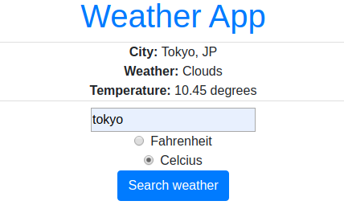
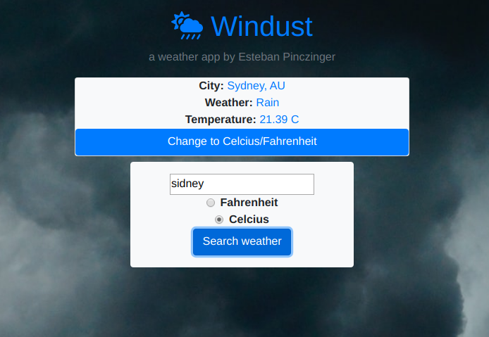

# Weather-app

> This project is a single-page website that was built as part of Microverse's API JavaScript module.

The main goal of this project is to show the understanding about asynchronous communication with promises or async/await and when to use them.

## Live Link

Have a look at the [Live Link](https://raw.githack.com/epinczinger/weather-app/development/dist/index.html)
Have in mind some images(for instance background images) may not load properly on raw.githack.

## Built With

- JavaScript
- Node Package Manager
- Webpack
- Bootstrap

## Getting Started

To get a local copy up and running follow these simple example steps.

### Prerequisites

### Setup

To set this project up locally, follow these simple instructions:

1. Open a Terminal and navigate to the location in your system where you would like to download the project. **New to Terminal? [Learn here](https://www.freecodecamp.org/news/conquering-the-command-line-f85f5e46c07c/).**

2. Enter the following line of code to clone this repository:

`git clone git@github.com:epinczinger/weather-app.git`

3. Now that the repository has been cloned, navigate inside it using `cd weather-app`.

4. The project's dependencies are managed by npm. To install them, enter the following line of code in the Terminal.

`npm install`

5. Congratulations! All necessary files have been installed. To view the website, just open 'dist/index.html' in a browser of your choosing.

## Author

👤 **Esteban Pinczinger**

  **Say hello! I don't bite.**

- Github: [epinczinger](https://github.com/epinczinger)
- Twitter: [@epinczinger](https://twitter.com/epinczinger)
- LinkedIn: [Esteban Pinczinger](https://www.linkedin.com/in/esteban-pinczinger)

## 🤝 Contributing

Contributions, issues and feature requests are welcome!

Feel free to check the [issues page](issues/).

## Show your support

Give a ⭐️ if you like this project!

## Acknowledgments

- This assignment was taken from [The Odin Project](https://www.theodinproject.com/courses/javascript/lessons/weather-app)'s Web Development course, which is available for free.

## 📝 License

This project is [MIT](lic.url) licensed.
